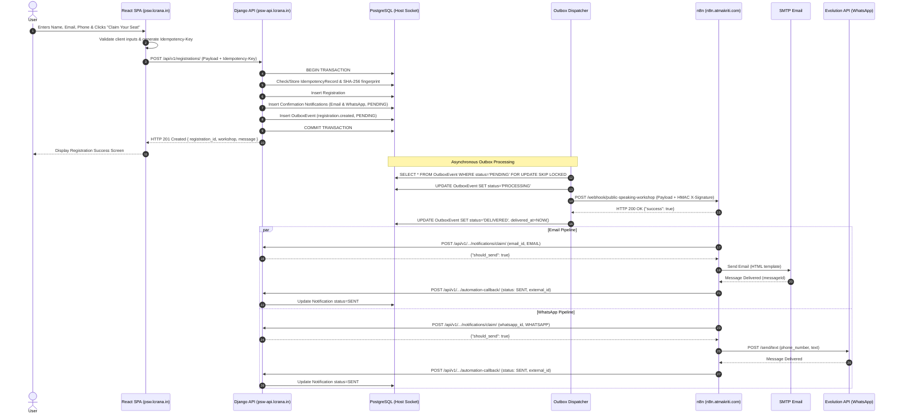
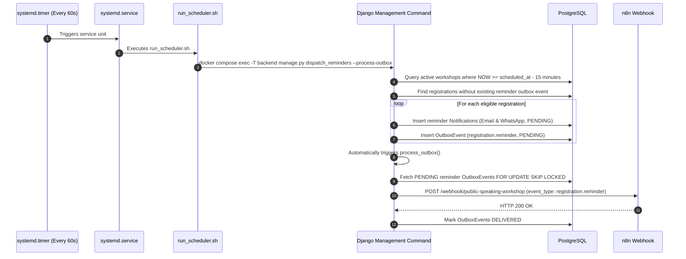

# Public Speaking Workshop: System Architecture & Interview Preparation Manual

This document is the definitive guide to the **Public Speaking Workshop** production platform. It outlines the architectural design, engineering decisions, end-to-end execution flows, DevOps/infrastructure setup, and an extensive question-and-answer guide designed for senior software engineering and system architecture interviews.

---

## Table of Contents
1. [Executive Summary & Problem Statement](#1-executive-summary--problem-statement)
2. [Complete Technology Stack Matrix](#2-complete-technology-stack-matrix)
3. [Key Architectural Patterns & Engineering Decisions](#3-key-architectural-patterns--engineering-decisions)
   - [3.1 The Dual-Write Problem & The Transactional Outbox Pattern](#31-the-dual-write-problem--the-transactional-outbox-pattern)
   - [3.2 Idempotency & Request Fingerprinting](#32-idempotency--request-fingerprinting)
   - [3.3 Distributed Notification State Machine: Claim & Callback](#33-distributed-notification-state-machine-claim--callback)
   - [3.4 Automated 15-Minute Scheduled Reminder Engine](#34-automated-15-minute-scheduled-reminder-engine)
   - [3.5 Zero-Trust Ingress & PostgreSQL Peer Socket Auth](#35-zero-trust-ingress--postgresql-peer-socket-auth)
   - [3.6 Production Static Asset Handling (WhiteNoise)](#36-production-static-asset-handling-whitenoise)
4. [End-to-End System Execution Flows](#4-end-to-end-system-execution-flows)
   - [Flow A: User Registration & Instant Confirmation](#flow-a-user-registration--instant-confirmation)
   - [Flow B: 15-Minute Automated Reminder Scheduler](#flow-b-15-minute-automated-reminder-scheduler)
   - [Flow C: Fault Tolerance, Poison-Pill, and Dead-Letter Handling](#flow-c-fault-tolerance-poison-pill-and-dead-letter-handling)
5. [Infrastructure & Setup Guide](#5-infrastructure--setup-guide)
   - [5.1 Docker Compose Services](#51-docker-compose-services)
   - [5.2 Cloudflare Tunnel Ingress](#52-cloudflare-tunnel-ingress)
   - [5.3 n8n Workflow & Evolution API Integration](#53-n8n-workflow--evolution-api-integration)
   - [5.4 Systemd Automation Timer](#54-systemd-automation-timer)
6. [Top Interview Questions & Model Answers](#6-top-interview-questions--model-answers)
   - [Category 1: System Design & Architecture](#category-1-system-design--architecture)
   - [Category 2: Concurrency, Transactions & The Outbox Pattern](#category-2-concurrency-transactions--the-outbox-pattern)
   - [Category 3: Idempotency & Dual-Delivery Mitigation](#category-3-idempotency--dual-delivery-mitigation)
   - [Category 4: Orchestration & Distributed State (n8n & Webhooks)](#category-4-orchestration--distributed-state-n8n--webhooks)
   - [Category 5: Docker, Linux Sockets & Networking](#category-5-docker-linux-sockets--networking)
   - [Category 6: Production War Stories & Debugging](#category-6-production-war-stories--debugging)
   - [Category 7: High-Scale Evolution (100k+ Users)](#category-7-high-scale-evolution-100k-users)
7. [Quick Command Reference](#7-quick-command-reference)

---

## 1. Executive Summary & Problem Statement

### The Business Objective
The **Public Speaking Workshop** platform is a mission-critical event registration and notification engine. The primary business goals are:
1. Deliver a high-converting, responsive landing page for prospective attendees.
2. Guarantee reliable, zero-duplicate registration processing even under network instability or repeated user submissions.
3. Automatically deliver multi-channel confirmations (Email via SMTP + WhatsApp via Evolution API).
4. Reliably trigger automated reminders **exactly 15 minutes before the workshop starts** (Asia/Kolkata timezone).

### The Technical Challenge
In naive web architectures, when a user submits a form, the backend handler writes to the database and immediately calls external third-party messaging APIs (or webhooks). This naive approach introduces severe architectural flaws:
* **The Dual-Write Problem**: If the external API call succeeds but the database transaction rolls back, the user receives a confirmation for an unregistered seat. Conversely, if the database commits but the external API times out, the user is registered but receives no confirmation.
* **Latency Spikes**: Tying user HTTP response times to third-party network latency degrades user experience.
* **Duplicate Notifications**: Retries across distributed boundaries (such as n8n or network retries) can cause users to be spammed with duplicate emails and WhatsApp messages.

### The Solution
We implemented a **decoupled, event-driven architecture** combining:
* **ACID Transactions** with the **Transactional Outbox Pattern** in PostgreSQL.
* **Idempotency Keys with SHA-256 Request Fingerprinting**.
* A **Distributed Claim-and-Callback Notification State Machine**.
* A **Systemd-Orchestrated Reminder Engine**.
* Multi-stage containerization behind **Cloudflare Zero Trust Tunnels**.

---

## 2. Complete Technology Stack Matrix

| Layer / Component | Technology | Version / Spec | Purpose / Role | Why Chosen |
|---|---|---|---|---|
| **Frontend UI** | React, TypeScript, Vite | React 18, Vite 5, TS 5 | Single Page Application (SPA) | Fast load times, type safety, modular component structure |
| **Styling** | Tailwind CSS | v3 | Modern responsive UI | Rapid styling, zero CSS runtime overhead, mobile-first design |
| **Frontend Server** | Nginx | 1.27-alpine | Serves static bundle inside Docker | Ultra-low memory footprint, handles SPA client routing (`try_files`) |
| **Backend Framework** | Django, Django REST Framework | Python 3.12, Django 5.1, DRF 3.15 | Core REST API, admin panel, business logic | High productivity, built-in ORM, robust transaction management |
| **Static Asset Engine** | WhiteNoise | 6.7+ | Production static asset serving | Eliminates separate Nginx proxy for admin CSS/JS in containerized Gunicorn |
| **WSGI Server** | Gunicorn | 23.0+ | Python WSGI HTTP server | Production-grade multi-worker concurrency (3 workers) |
| **Database** | PostgreSQL | 16 (Host Native) | Relational primary data store | Robust ACID transactions, row-level locking (`FOR UPDATE SKIP LOCKED`), JSONB |
| **Automation Engine** | n8n (Self-Hosted) | Latest | Notification workflow orchestration | Visual workflow control, self-hosted data privacy, native SMTP & HTTP nodes |
| **WhatsApp Provider** | Evolution API | Self-Hosted | WhatsApp message dispatch | Direct Baileys-based WhatsApp gateway without Meta per-conversation markups |
| **Scheduler** | Linux Systemd Timer | `systemd` (Host) | Periodic reminder & outbox trigger | Deterministic, lightweight 60s execution without Celery/Redis memory overhead |
| **Edge & Ingress** | Cloudflare Tunnel | `cloudflared` | Secure public ingress | No open inbound firewall ports, automated SSL, DDoS mitigation |

---

## 3. Key Architectural Patterns & Engineering Decisions

### 3.1 The Dual-Write Problem & The Transactional Outbox Pattern

In microservices and distributed systems, the **Dual-Write Problem** occurs whenever an application needs to update a database AND notify an external system (such as an external webhook or queue) within the same user flow.

```
[Naive Approach - Anti-Pattern]
User Request ──> [Django View] ──(1) Write DB──> [PostgreSQL]
                      │
                      └──(2) HTTP POST (n8n Webhook) ──> Network Failure!
                             (Result: DB committed, but notification lost!)
```

#### Our Implementation:
We implemented the **Transactional Outbox Pattern**:
1. When a registration request arrives, the `Registration`, the `IdempotencyRecord`, two `Notification` records (`EMAIL` and `WHATSAPP`), and an `OutboxEvent` (`registration.created`) are inserted inside a **single atomic PostgreSQL transaction** (`transaction.atomic()`).
2. If the transaction commits, the event is guaranteed to exist in the `integrations_outboxevent` table. If the transaction fails, nothing is saved and no event is queued.
3. The HTTP response is returned immediately to the client with `201 Created` without waiting for external network calls.
4. A dedicated asynchronous dispatcher (`process_outbox`) queries pending outbox events using **row-level pessimistic locking** (`SELECT ... FOR UPDATE SKIP LOCKED`), marks them `PROCESSING`, sends them to n8n, and transitions them to `DELIVERED` or `FAILED` (with exponential backoff).

```
[Our Architecture - Transactional Outbox]
User Request ──> [Django API]
                      │
           ┌──────────┴──────────┐
           │ Atomic Transaction  │
           │  1. Registration    │
           │  2. Notifications   │
           │  3. OutboxEvent     │
           └──────────┬──────────┘
                      │ Commit
                      ▼
               [PostgreSQL DB]
                      ▲
                      │ (SELECT FOR UPDATE SKIP LOCKED)
             [process_outbox Worker]
                      │
                      └──(POST with HMAC signature)──> [n8n Webhook]
```

---

### 3.2 Idempotency & Request Fingerprinting

Network retries or impatient users repeatedly tapping "Submit" can easily create duplicate registrations and spam users with notifications.

#### Our Implementation:
1. **Client-Provided Idempotency Key**: The client generates a unique UUID (or passes a custom `Idempotency-Key` header).
2. **Payload Fingerprinting**: We compute a `SHA-256` hash of the normalized request body (`full_name`, `normalized_email`, `phone_number`, `workshop_id`).
3. **Collision & Replay Detection**:
   * If the `idempotency_key` has already been processed with the **same** payload hash, Django returns the cached HTTP 201 response directly without re-executing logic.
   * If the same `idempotency_key` is submitted with a **different** payload hash, Django raises an `HTTP 409 Conflict` ("Idempotency key reused with differing request payload").
4. **Database Constraint**: `Registration` has a unique constraint on `(workshop_id, normalized_email)`. Even if two concurrent requests bypass the application layer simultaneously, the PostgreSQL unique index enforces data integrity.

---

### 3.3 Distributed Notification State Machine: Claim & Callback

In a multi-step distributed pipeline, what happens if n8n crashes mid-workflow, or an operator triggers a manual workflow retry? Without safeguards, the user would receive duplicate emails or WhatsApp messages.

We designed a **two-phase Claim-and-Callback protocol**:

```
 [n8n Workflow]                             [Django Backend]
       │                                           │
       ├─── 1. POST /api/v1/.../claim/ ───────────>│ Check notification status:
       │    (notification_id, channel)             │ If PENDING -> mark SENDING, return should_send: true
       │<── 2. Response: { should_send: true } ────│ If SENDING/SENT -> return should_send: false
       │                                           │
[If should_send == true]                           │
       │                                           │
       ├─── 3. Deliver via SMTP / Evolution API    │
       │                                           │
       ├─── 4. POST /api/v1/.../callback/ ────────>│ Update status to SENT
       │    (status: SENT, external_id: "...")     │ Record sent_at timestamp & message ID
       │<── 5. HTTP 200 OK ────────────────────────│
```

#### Why this is bulletproof:
1. **Atomic Claim**: When n8n starts processing a notification branch, it calls `/api/v1/integrations/notifications/claim/`. Django uses `select_for_update()` on the `Notification` record. If the status is `PENDING`, it updates the status to `SENDING` and returns `{ "should_send": true }`.
2. **Idempotent Guard**: If n8n attempts to run the same branch twice, the claim endpoint detects that the status is already `SENDING` or `SENT` and returns `{ "should_send": false }`. n8n's conditional node skips the dispatch immediately.
3. **Terminal Callback**: Once the provider accepts the message, n8n invokes `/api/v1/integrations/automation-callback/`, recording delivery metadata (`SENT`, `external_id`) or failure diagnostics (`FAILED`, error reason).

---

### 3.4 Automated 15-Minute Scheduled Reminder Engine

#### Requirements:
* Each participant must receive an automated Email and WhatsApp reminder **exactly 15 minutes before the workshop starts**.
* Workshop date: `2026-09-18 15:30:00` in `Asia/Kolkata` (IST).
* Reminder trigger time: `2026-09-18 15:15:00 IST`.

#### Architectural Choice: Systemd Timer vs. Celery Beat
Instead of introducing Redis and Celery (which consume 200MB+ RAM and require persistent broker monitoring for a simple scheduled task), we utilized a native **Linux systemd timer** triggering an idempotent Django management command:
```
[systemd.timer (Every 60s)] ──> [systemd.service] ──> [run_scheduler.sh]
                                                             │
                                                             ▼
                                     [docker compose exec -T backend]
                                                             │
                                                             ▼
                                     [python manage.py dispatch_reminders]
```

#### Idempotency in Reminder Generation:
* The command calculates `reminder_window_start = workshop.scheduled_at - timedelta(minutes=15)`.
* It queries active workshops where `now >= reminder_window_start`.
* For each confirmed registration, it checks whether a `registration.reminder` outbox event has already been recorded for this registration ID.
* If not, it creates the reminder notifications and outbox event in an atomic transaction.
* Running the scheduler multiple times is 100% idempotent.

---

### 3.5 Zero-Trust Ingress & PostgreSQL Peer Socket Auth

1. **Cloudflare Zero Trust Tunnels**:
   * No inbound firewall ports (ports 80, 443, 8000, 8088) are exposed to the public internet.
   * A local daemon (`cloudflared`) establishes persistent outbound TLS connections to Cloudflare's edge servers.
   * `psw.lcrana.in` routes to `http://localhost:8088` (Nginx container).
   * `psw-api.lcrana.in` routes to `http://localhost:8000` (Gunicorn container).
2. **PostgreSQL Socket Peer Authentication**:
   * Instead of exposing PostgreSQL over TCP (`0.0.0.0:5432`) with plain-text passwords in environment variables, we mount the Linux host UNIX socket `/var/run/postgresql:/var/run/postgresql` into the backend container.
   * The backend container runs as a non-root user `appuser` with UID `1001` and GID `1001`, matching the host `ubuntu` user.
   * PostgreSQL validates the connection via the kernel using local UNIX peer authentication. This achieves zero network overhead, zero port exposure, and zero database password storage.

---

### 3.6 Production Static Asset Handling (WhiteNoise)

In development (`DEBUG=True`), Django's runserver automatically serves static files. In production (`DEBUG=False`) under Gunicorn, Django disables this behavior. Without a static file handler, requests to `/static/admin/*` fail with **HTTP 404**, resulting in an unstyled admin interface.

#### Solution:
* Integrated **WhiteNoise** (`whitenoise.middleware.WhiteNoiseMiddleware`).
* Configured `CompressedManifestStaticFilesStorage` in Django `STORAGES`.
* During Docker build, `python manage.py collectstatic --noinput` copies and fingerprints all assets into `/app/staticfiles`.
* Gunicorn serves cached, compressed, fingerprinted static files directly with `Cache-Control: max-age=31536000, immutable`.

---

## 4. End-to-End System Execution Flows

### Flow A: User Registration & Instant Confirmation



---

### Flow B: 15-Minute Automated Reminder Scheduler



---

### Flow C: Fault Tolerance, Poison-Pill, and Dead-Letter Handling

1. **Network Outage to n8n**:
   * If n8n returns HTTP 5xx or times out, the outbox dispatcher catches the exception.
   * The event's `retry_count` is incremented, and `next_retry_at` is updated using **exponential backoff with jitter** (`retry_delay = 2 ^ retry_count * base_seconds`).
   * The event is released back to `PENDING` status.
2. **Poison Pill / Fatal Payloads**:
   * If an event repeatedly fails up to `max_retries` (default: 5), it is automatically transitioned to `FAILED` status and logged with its stack trace in `last_error`.
   * This prevents failing events from blocking other pending outbox events.
3. **Database Concurrency Protection**:
   * By using `SELECT ... FOR UPDATE SKIP LOCKED`, multiple workers can poll the outbox concurrently without lock contention or duplicate event processing.

---

## 5. Infrastructure & Setup Guide

### 5.1 Docker Compose Services

The project uses two production containers defined in [`docker-compose.yml`](file:///home/ubuntu/apps/public-speaking-workshop/docker-compose.yml):

```yaml
services:
  backend:
    build:
      context: ./backend
      dockerfile: Dockerfile
      args:
        APP_UID: 1001
        APP_GID: 1001
    container_name: psw-backend
    restart: unless-stopped
    env_file: .env
    environment:
      - DJANGO_SETTINGS_MODULE=config.settings.production
      - DB_NAME=public_speaking_workshop
      - DB_USER=ubuntu
      - DB_HOST=/var/run/postgresql
      - ALLOWED_HOSTS=psw-api.lcrana.in,localhost,127.0.0.1,backend
      - CORS_ALLOWED_ORIGINS=https://psw.lcrana.in
      - CSRF_TRUSTED_ORIGINS=https://psw.lcrana.in,https://psw-api.lcrana.in
    volumes:
      - /var/run/postgresql:/var/run/postgresql
    ports:
      - "127.0.0.1:8000:8000"

  frontend:
    build:
      context: ./frontend
      dockerfile: Dockerfile
      args:
        VITE_API_BASE_URL: https://psw-api.lcrana.in
    container_name: psw-frontend
    restart: unless-stopped
    ports:
      - "127.0.0.1:8088:80"
```

---

### 5.2 Cloudflare Tunnel Ingress

Cloudflare Tunnel manages secure edge routing without public firewall ingress:

| Public Domain | Route Target | Container | Description |
|---|---|---|---|
| `https://psw.lcrana.in` | `http://localhost:8088` | `psw-frontend` | React SPA landing page |
| `https://psw-api.lcrana.in` | `http://localhost:8000` | `psw-backend` | Django REST API & Admin Panel |
| `https://n8n.atmakriti.com` | Internal host service | `n8n` | Automation Workflow Engine |
| `https://evolution.lcrana.in` | Internal host service | `evolution-api` | WhatsApp Gateway |

---

### 5.3 n8n Workflow & Evolution API Integration

The n8n workflow file is maintained in version control at [`n8n/public-speaking-workshop-workflow.json`](file:///home/ubuntu/apps/public-speaking-workshop/n8n/public-speaking-workshop-workflow.json):
* **Webhook Trigger**: `POST /webhook/public-speaking-workshop`
* **Security**: Validates `X-Signature` HMAC hash or shared secret.
* **Normalization Code Node**: Resolves whether the event is `registration.created` or `registration.reminder`. Generates responsive HTML email templates and WhatsApp copy dynamically.
* **Parallel Execution**: Dispatches Email branch and WhatsApp branch concurrently.
* **Claim & Callback Nodes**: Points to production endpoints:
  - Claim: `https://psw-api.lcrana.in/api/v1/integrations/notifications/claim/`
  - Callback: `https://psw-api.lcrana.in/api/v1/integrations/automation-callback/`

---

### 5.4 Systemd Automation Timer

Located at:
* Unit service: `/etc/systemd/system/public-speaking-workshop-reminders.service`
* Unit timer: `/etc/systemd/system/public-speaking-workshop-reminders.timer`

Execution verification:
```bash
# Check timer status and next trigger time
systemctl status public-speaking-workshop-reminders.timer

# View scheduler execution logs
journalctl -u public-speaking-workshop-reminders.service -n 50 --no-pager
```

---

## 6. Top Interview Questions & Model Answers

### Category 1: System Design & Architecture

#### Q1: "Can you walk me through the high-level architecture of this application?"
**Model Answer:**
> "The system is designed as a decoupled, event-driven web application composed of three primary tiers:
> 1. **Client Tier**: A responsive React 18 SPA built with Vite and Tailwind CSS, served through Nginx with immutable caching headers for static assets and strict revalidation for `index.html`.
> 2. **Core Application Tier**: A Django 5.1 and Django REST Framework backend running on Gunicorn with WhiteNoise inside Docker. It exposes idempotent REST endpoints, enforces domain business logic, and manages relational data in PostgreSQL 16 using UNIX socket peer authentication.
> 3. **Asynchronous Automation & Delivery Tier**: We avoid coupling Django synchronously to external messaging services. Instead, we use the **Transactional Outbox Pattern**. An outbox dispatcher delivers events to a self-hosted **n8n** instance, which handles SMTP email delivery and calls **Evolution API** for WhatsApp messages. Delivery status is synchronized back to Django using a two-phase Claim-and-Callback pattern.
> 
> The entire public interface is secured using Cloudflare Zero Trust Tunnels, meaning no inbound ports are open to the internet."

---

#### Q2: "Why did you separate the notification dispatching to n8n rather than writing Python Celery tasks directly in Django?"
**Model Answer:**
> "We separated messaging orchestration into n8n for three reasons:
> 1. **Decoupling Core Domain Logic from External Third-Party APIs**: Email templates, Evolution API payload structures, and delivery providers change frequently. By keeping Django focused strictly on event generation and state recording, the core application remains clean and decoupled.
> 2. **Operational Observability**: n8n provides visual execution tracking, per-step payload inspection, and interactive execution retries without needing custom Django admin dashboards or flower setups.
> 3. **Resource Efficiency**: A lightweight n8n instance handles multi-channel coordination, rate limiting, and provider error formatting without consuming Django worker threads."

---

### Category 2: Concurrency, Transactions & The Outbox Pattern

#### Q3: "What is the Transactional Outbox Pattern, and what exact failure modes does it prevent in this project?"
**Model Answer:**
> "In distributed systems, the dual-write problem occurs when an application writes to a database and makes an external network call (like an HTTP webhook) in the same handler. 
> 
> If the network call fails or times out after the database write, the user is registered but never receives a confirmation. If the network call succeeds but the database transaction fails to commit, the user receives a confirmation for a registration that doesn't exist.
> 
> The Transactional Outbox Pattern solves this by writing both the domain entity (`Registration`) and the notification task (`OutboxEvent`) into the database within the **same atomic ACID transaction**. Because both writes are committed together, we achieve **guaranteed consistency**. An asynchronous worker polls the outbox table and delivers the event to n8n. If n8n is temporarily down, the event remains safely in PostgreSQL and retries with exponential backoff."

---

#### Q4: "How does the outbox dispatcher prevent race conditions if multiple workers are running concurrently?"
**Model Answer:**
> "We use PostgreSQL's row-level locking feature: `SELECT ... FOR UPDATE SKIP LOCKED`.
> 
> When a worker polls for pending outbox events:
> ```python
> OutboxEvent.objects.select_for_update(skip_locked=True).filter(status='PENDING')[:batch_size]
> ```
> PostgreSQL immediately locks the selected rows for that worker's transaction. If a second worker executes the query at the exact same millisecond, `SKIP LOCKED` instructs PostgreSQL to bypass the locked rows and select the next available batch without waiting or blocking. This guarantees that two workers never process the same outbox event simultaneously."

---

### Category 3: Idempotency & Dual-Delivery Mitigation

#### Q5: "How do you ensure that a user double-clicking 'Register' doesn't create duplicate records or get charged/notified twice?"
**Model Answer:**
> "We enforce idempotency at three distinct layers:
> 1. **Client Key**: The client generates an `Idempotency-Key` header with each submission.
> 2. **Application Fingerprint Verification**: In Django, we store an `IdempotencyRecord` containing the key and a SHA-256 hash of the normalized request body (`full_name`, `normalized_email`, `phone_number`). If a request with the same key arrives, Django checks the hash. If identical, it returns the cached response immediately. If the payload differs, it returns `409 Conflict`.
> 3. **Database Unique Constraints**: In PostgreSQL, the `Registration` model enforces a `UniqueConstraint(fields=['workshop', 'normalized_email'])`. Even in an extreme race condition where two requests pass the application check simultaneously, the PostgreSQL B-Tree index guarantees only one record can be committed."

---

#### Q6: "How do you prevent duplicate email or WhatsApp messages if an n8n workflow is retried?"
**Model Answer:**
> "We implemented an explicit **Claim-and-Callback state machine**.
> Before n8n sends an email or WhatsApp message, it must first execute an HTTP call to our backend: `POST /api/v1/integrations/notifications/claim/`.
> 
> Inside Django, we lock the notification row (`select_for_update()`). If the status is `PENDING`, Django transitions it to `SENDING` and returns `{ "should_send": true }`.
> If n8n retries the workflow, the claim endpoint detects that the status is already `SENDING` or `SENT` and returns `{ "should_send": false }`. n8n's IF node evaluates this and immediately skips dispatching the message."

---

### Category 4: Orchestration & Distributed State (n8n & Webhooks)

#### Q7: "How do you secure webhooks between Django and n8n?"
**Model Answer:**
> "We enforce two security layers:
> 1. **HMAC-SHA256 Signatures**: When Django dispatches an outbox event to n8n, it computes an HMAC-SHA256 signature of the raw JSON body using a shared secret (`AUTOMATION_WEBHOOK_SECRET`) and sends it in the `X-Signature` header. n8n verifies this signature before processing the payload.
> 2. **Shared Secret Verification on Callbacks**: When n8n makes claim or callback requests to Django, it must supply the `X-Webhook-Secret` header. Django's `verify_webhook_secret` helper validates this header against the server configuration in constant time, rejecting unauthorized requests with `401 Unauthorized`."

---

### Category 5: Docker, Linux Sockets & Networking

#### Q8: "How does Django connect to PostgreSQL without a database password in the Docker environment?"
**Model Answer:**
> "We use **UNIX Socket Peer Authentication**.
> Instead of exposing PostgreSQL on TCP port `5432` with a database password, we mount the host's `/var/run/postgresql` socket directory directly into the backend container.
> 
> We configure the Docker container to run as `appuser` with UID `1001` and GID `1001`, which matches the host user `ubuntu`. When Django connects to `/var/run/postgresql/.s.PGSQL.5432`, the Linux kernel provides the caller's UID directly to the PostgreSQL server. PostgreSQL verifies peer authentication against `pg_hba.conf` and grants access. This eliminates plain-text database credentials and prevents network sniffing."

---

#### Q9: "Why use a systemd timer instead of Celery Beat or a cron job?"
**Model Answer:**
> "For our workload (running an idempotent check every 60 seconds), Celery Beat and Redis would add unnecessary operational overhead and memory consumption (around 150-250MB RAM).
> 
> Standard cron lacks native execution observability, retry policies, and structured logging.
> 
> A **systemd timer and oneshot service** is native to Linux, has zero memory overhead when idle, automatically logs stdout and stderr directly to `systemd-journald` (`journalctl`), and integrates with modern process monitoring."

---

### Category 6: Production War Stories & Debugging

#### Q10: "Can you share a real production bug you encountered during this deployment and how you diagnosed and resolved it?"
**Model Answer:**
> "During our production verification, we encountered two notable issues:
> 
> **Incident 1: The DisallowedHost 400 Bad Request in n8n**
> * *Symptom*: In the n8n execution log, the `10 - Email Claim` node failed with `400 Bad Request`.
> * *Root Cause*: The workflow was still configured with a temporary development Cloudflare tunnel URL (`https://describing-impact...trycloudflare.com`). In production, Django's `ALLOWED_HOSTS` strictly permitted `psw-api.lcrana.in`. When Django received a request addressed to the old tunnel hostname, `SecurityMiddleware` rejected it with `DisallowedHost (400)`.
> * *Resolution*: We updated all 6 claim and callback HTTP nodes in the n8n workflow to point to the official production backend URL (`https://psw-api.lcrana.in`), successfully retested the claim endpoint, and committed the workflow JSON to git.
> 
> **Incident 2: Unstyled Django Admin Panel (Static Files 404)**
> * *Symptom*: Accessing `/admin/` in production rendered raw, unstyled HTML.
> * *Root Cause*: In production (`DEBUG=False`), Gunicorn does not serve static assets. Because Cloudflare Tunnel routes traffic directly to Gunicorn on port 8000 without an intermediate Nginx reverse proxy, static file requests returned 404.
> * *Resolution*: We integrated **WhiteNoise**, placed `WhiteNoiseMiddleware` right after `SecurityMiddleware`, configured `CompressedManifestStaticFilesStorage`, and ensured `collectstatic` runs during the Docker image build. This allowed Gunicorn to serve fingerprinted, compressed static assets with high performance and zero external dependencies."

---

### Category 7: High-Scale Evolution (100k+ Users)

#### Q11: "If this workshop application grew from hundreds of attendees to 100,000 registrations per hour, what bottlenecks would emerge and how would you redesign the architecture?"
**Model Answer:**
> "At 100,000 registrations per hour (~30 requests/sec average, with flash crowds peaking at 1,000+ req/sec):
> 
> 1. **Ingress & Compute Scaling**:
>    * Move from a single Docker host to a Kubernetes cluster (EKS/GKE) or AWS ECS with an Application Load Balancer and Horizontal Pod Autoscaling (HPA) based on CPU and request queue depth.
> 2. **Database Write Bottleneck**:
>    * PostgreSQL row locking on `select_for_update()` during outbox polling would experience contention.
>    * We would replace the relational outbox polling with an external distributed commit log such as **Apache Kafka** or **AWS SQS / GCP PubSub**.
>    * Using **Debezium for Change Data Capture (CDC)**, Debezium reads PostgreSQL's write-ahead log (WAL) and streams outbox events directly into Kafka without touching the database engine with polling queries.
> 3. **Messaging Rate Limits**:
>    * WhatsApp (Evolution API / Meta Cloud API) and SMTP servers enforce rate limits (e.g. 50-100 messages/sec).
>    * We would introduce worker pools with token-bucket rate limiters and dedicated dead-letter queues (DLQ) to smooth message dispatch spikes over time."

---

## 7. Quick Command Reference

### Service & Container Management
```bash
# Check running containers
docker compose ps

# View live backend logs
docker compose logs -f backend

# Rebuild backend container after requirements or code changes
docker compose up -d --build backend

# Run Django tests
docker compose exec -T backend python manage.py test apps config
```

### Database & Outbox Operations
```bash
# Apply migrations
docker compose exec -T backend python manage.py migrate

# Seed or verify workshop
docker compose exec -T backend python manage.py seed_workshop

# Manually process outbox events (dry-run)
docker compose exec -T backend python manage.py process_outbox --dry-run

# Manually dispatch reminders
docker compose exec -T backend python manage.py dispatch_reminders --process-outbox
```

### Scheduler & Timers
```bash
# Check reminder timer
systemctl status public-speaking-workshop-reminders.timer

# View scheduler execution logs
journalctl -u public-speaking-workshop-reminders.service -n 50 --no-pager
```
