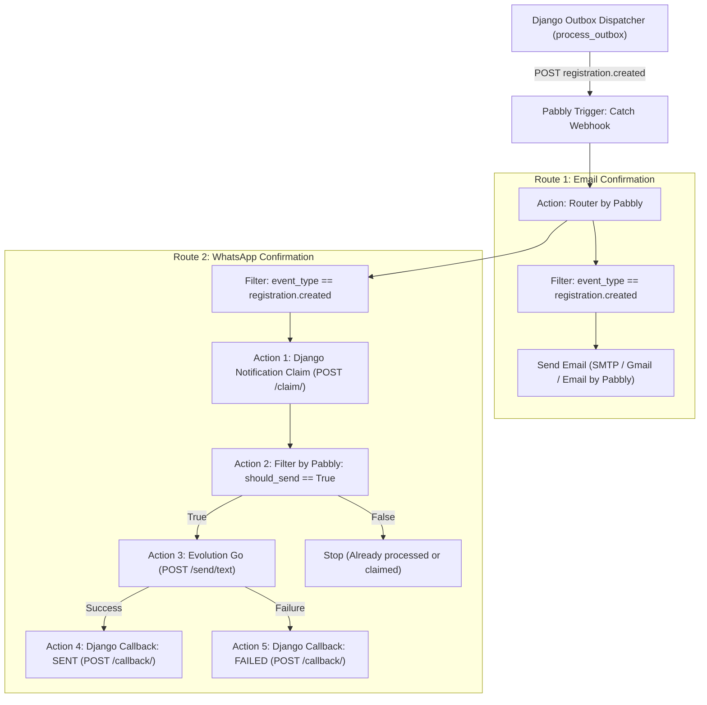

# Phase 4B: Pabbly Confirmation Automation Guide (Email & WhatsApp) [DEPRECATED]

> [!WARNING]
> **HISTORICAL REFERENCE ONLY — DEPRECATED**:
> Automation has been completely migrated from Pabbly Connect to self-hosted n8n (`https://n8n.atmakriti.com`).
> This document is preserved for historical reference only.
> Active workflow configuration resides in `n8n/public-speaking-workshop-workflow.json`.

This document specifies the legacy procedures previously used for Phase 4B with Pabbly Connect.

---

## 1. Overview & Architecture

When Django dispatches an outbox event with `event_type = registration.created`, Pabbly Connect orchestrates two independent notifications:
1. **Confirmation Email** (SMTP / Gmail / Email by Pabbly)
2. **Confirmation WhatsApp message** via Evolution Go

### Core Invariants:
* **Failure Isolation**: Email and WhatsApp must be completely independent branches via **Router by Pabbly**. A failure in Email must NOT block WhatsApp, and a failure in WhatsApp must NOT block Email.
* **Provider Agnosticism**: Django is the system of record. Pabbly claims notifications and reports back delivery via provider-agnostic internal endpoints.
* **Idempotency & Concurrency Safety**: A notification cannot be claimed or sent twice for the same event.



---

## 2. Event Payload Contract

The incoming webhook payload from Django's transactional outbox contains:

```json
{
  "event_id": "3b54dd9c-d3fb-4dcf-8663-99f63426073a",
  "event_type": "registration.created",
  "version": "1.0",
  "occurred_at": "2026-09-17T15:31:53.607569+00:00",
  "data": {
    "registration": {
      "id": "b32328eb-de16-4356-9667-15a726b2cabc",
      "full_name": "Laxman Chandra Rana",
      "email": "lcrana002@gmail.com",
      "phone_number": "+918167749719",
      "registered_at": "2026-09-17T15:31:53.605184+00:00"
    },
    "workshop": {
      "id": "public-speaking-workshop",
      "title": "Public Speaking Workshop",
      "scheduled_at_iso": "2026-09-18T15:30:00+05:30",
      "timezone": "Asia/Kolkata",
      "reminder_at_iso": "2026-09-18T15:15:00+05:30"
    },
    "notifications": {
      "confirmation_whatsapp_id": "77e3848b-3b47-49ef-92e1-7e8e11a3b56c",
      "confirmation_email_id": "4b689a74-a09c-47ea-a846-9d8a5fa6c88f"
    },
    "messages": {
      "whatsapp_text": "Hi Laxman Chandra Rana, your registration for Public Speaking Workshop is confirmed! Date: 18 September 2026, 3:30 PM Asia/Kolkata. We will send a reminder 15 minutes before the session starts."
    }
  }
}
```

---

## 3. Django Integration Endpoints

All internal integration endpoints are secured with `AUTOMATION_WEBHOOK_SECRET`. Requests must pass either:
* Header: `X-Webhook-Secret: <AUTOMATION_WEBHOOK_SECRET>`
* Header: `Authorization: Bearer <AUTOMATION_WEBHOOK_SECRET>`

### 3.1. Notification Claim Endpoint
* **Endpoint:** `POST /api/v1/integrations/notifications/claim/`
* **Purpose:** Atomically claims a `PENDING` notification using PostgreSQL row-locking (`select_for_update`) and transitions it to `PROCESSING`. Supports stale lease recovery if a previous worker crashed.
* **Request:**
  ```json
  {
    "notification_id": "77e3848b-3b47-49ef-92e1-7e8e11a3b56c",
    "channel": "WHATSAPP"
  }
  ```
  *(Note: Can also pass `registration_id` or `event_id` if `notification_id` is omitted).*
* **Success Response (Allowed to send):**
  ```json
  {
    "should_send": true,
    "notification_id": "77e3848b-3b47-49ef-92e1-7e8e11a3b56c",
    "channel": "WHATSAPP",
    "status": "PROCESSING",
    "processing_started_at": "2026-09-17T16:15:00.000000+00:00",
    "message": "Notification successfully claimed for processing."
  }
  ```
* **Rejection Response (Must NOT send):**
  ```json
  {
    "should_send": false,
    "notification_id": "77e3848b-3b47-49ef-92e1-7e8e11a3b56c",
    "channel": "WHATSAPP",
    "status": "PROCESSING",
    "reason": "Notification is actively in PROCESSING state."
  }
  ```

---

### 3.2. Automation Callback Endpoint
* **Endpoint:** `POST /api/v1/integrations/automation-callback/`
* **Purpose:** Acknowledges delivery outcome, sets timestamps, records external provider IDs, and clears processing leases.
* **Request (Success):**
  ```json
  {
    "notification_id": "77e3848b-3b47-49ef-92e1-7e8e11a3b56c",
    "channel": "WHATSAPP",
    "status": "SENT",
    "external_id": "provider-msg-id-123",
    "error": null
  }
  ```
* **Request (Failure):**
  ```json
  {
    "notification_id": "77e3848b-3b47-49ef-92e1-7e8e11a3b56c",
    "channel": "WHATSAPP",
    "status": "FAILED",
    "external_id": null,
    "error": "WhatsApp recipient unreachable"
  }
  ```
* **Invariants:**
  * Callback is idempotent: calling it multiple times is harmless.
  * State downgrade protection: Stale or delayed callbacks cannot revert an already-`SENT` notification back to `FAILED` or `PROCESSING`.

---

## 4. Evolution Go Configuration (WhatsApp)

* **Engine & Version:** `Evolution Go v0.7.2` (custom build).
* **Public Endpoint:** `https://evolution.lcrana.in`
* **Send Endpoint:** `POST https://evolution.lcrana.in/send/text`
* **Authentication:** Header `apikey: <EVOLUTION_API_KEY>` (stored securely in `.env` / Pabbly; never hardcoded).
* **Active Instance:** `LCR` (Connected: `true`, LoggedIn: `true`).
* **Request Body:**
  ```json
  {
    "number": "{{data.registration.phone_number}}",
    "text": "{{data.messages.whatsapp_text}}"
  }
  ```

---

## 5. Pabbly WhatsApp Branch Configuration (Step-by-Step)

In your Pabbly workflow `Public Speaking Workshop - Registrations`:

### Step 1: Open Route 2 (WhatsApp Confirmation)
1. In **Router by Pabbly**, click **Set Filter & Action Steps** on `Route 2: WhatsApp Confirmation`.
2. Filter condition: `event_type` `(Equal to)` `registration.created`.

### Step 2: Add Action — Claim Notification (API by Pabbly)
* **App:** `API by Pabbly`
* **Action Event:** `Custom Request`
* **Method:** `POST`
* **API Endpoint URL:** `https://<YOUR_DJANGO_HOST>/api/v1/integrations/notifications/claim/`
* **Headers:**
  | Key | Value |
  |---|---|
  | `Content-Type` | `application/json` |
  | `X-Webhook-Secret` | `<AUTOMATION_WEBHOOK_SECRET>` |
* **Body (JSON):**
  ```json
  {
    "notification_id": "{{data.notifications.confirmation_whatsapp_id}}",
    "channel": "WHATSAPP"
  }
  ```

### Step 3: Add Filter — Verify Claim Granted
* **App:** `Filter by Pabbly`
* **Condition:** `should_send` `(Equal to)` `true` (Boolean/string).
* *Note: If `should_send` is `false`, Pabbly stops this branch immediately, preventing duplicate WhatsApp messages.*

### Step 4: Add Action — Send WhatsApp Message (Evolution Go)
* **App:** `API by Pabbly`
* **Action Event:** `Custom Request`
* **Method:** `POST`
* **API Endpoint URL:** `https://evolution.lcrana.in/send/text`
* **Headers:**
  | Key | Value |
  |---|---|
  | `Content-Type` | `application/json` |
  | `apikey` | `<EVOLUTION_API_KEY>` |
* **Body (JSON):**
  ```json
  {
    "number": "{{data.registration.phone_number}}",
    "text": "{{data.messages.whatsapp_text}}"
  }
  ```

### Step 5: Add Action — Report Delivery to Django Callback
* **App:** `API by Pabbly`
* **Action Event:** `Custom Request`
* **Method:** `POST`
* **API Endpoint URL:** `https://<YOUR_DJANGO_HOST>/api/v1/integrations/automation-callback/`
* **Headers:**
  | Key | Value |
  |---|---|
  | `Content-Type` | `application/json` |
  | `X-Webhook-Secret` | `<AUTOMATION_WEBHOOK_SECRET>` |
* **Body (JSON):**
  ```json
  {
    "notification_id": "{{data.notifications.confirmation_whatsapp_id}}",
    "channel": "WHATSAPP",
    "status": "SENT",
    "external_id": "{{data.data.id}}"
  }
  ```

---

## 6. Security Model

1. **Credential Rotation Completed:**
   * The instance API key for Evolution Go has been rotated in PostgreSQL and stored securely in `.env`.
   * The old exposed credential was revoked and now returns `HTTP 401 Unauthorized`.
2. **Zero Client Exposure:**
   * Neither the Evolution API key nor the Django automation webhook secret are exposed to React frontend code, public repositories, or client bundles.
3. **Internal Endpoint Authentication:**
   * Both `/claim/` and `/automation-callback/` strictly enforce timing-safe HMAC / secret verification.

---

## 7. Verification & Testing

| Test Case | Description | Status |
|---|---|---|
| **Claim PENDING** | Claims `PENDING` notification and transitions to `PROCESSING` | Verified (Test Suite) |
| **Claim Duplicate** | Second simultaneous claim gets `should_send=False` | Verified (Test Suite) |
| **Claim SENT** | Re-claiming an already sent message returns `should_send=False` | Verified (Test Suite) |
| **Stale Lease Recovery** | Crashed workers' leases are automatically recovered after timeout | Verified (Test Suite) |
| **Callback SENT** | Transitions `PROCESSING -> SENT`, records `sent_at` and `external_id` | Verified (Test Suite) |
| **Callback FAILED** | Transitions `PROCESSING -> FAILED`, increments `attempts` and saves `last_error` | Verified (Test Suite) |
| **Callback Idempotency** | Replaying callback is harmless and cannot downgrade `SENT` | Verified (Test Suite) |
| **Row Locking Safety** | Concurrent requests safely serialize under PostgreSQL row locks | Verified (Test Suite) |
| **Secret Enforcement** | Unauthorized requests without valid `X-Webhook-Secret` rejected with 401 | Verified (Test Suite) |
